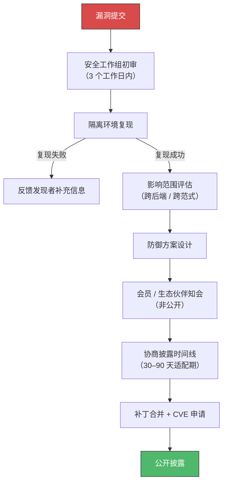

# triton-anchor 安全漏洞公开与响应流程

> 本文档定义了 triton-anchor 项目的安全漏洞发现、申报、审核及公开披露的标准化流程。

---

## 1. 概述与漏洞分类

在 triton-anchor 社区，我们将缺陷（Bugs）严格区分为两类：

### 功能类缺陷 (Functional Bugs)

如编译报错、特定算子性能下降、不支持的 Triton API 等。

👉 请直接在 [triton-anchor GitHub 仓库](../../issues/new/choose) 提交 Issue。

### 安全类漏洞 (Security Bugs)

包括但不限于：

- 恶意构造的 Triton Kernel **绕过 AnchorIR 白名单检查**
- 导致编译器**越界读写 / 崩溃**
- 生成可执行**恶意提权代码**的底层二进制

> [!CAUTION]
> 由于安全漏洞可能直接影响下游集成该前端的多种 RISC-V AI 处理器与硬件设备，**请勿在公开的 GitHub Issue 中讨论安全漏洞**。请严格遵循以下安全申报与公开流程。

---

## 2. 注册与申报流程

为了保护发现者的权益并建立安全的沟通渠道，请通过**安全邮箱**提交漏洞报告：

📧 **huangkang@bosc.ac.cn**

> [!IMPORTANT]
> 请勿通过 GitHub Issue、Discussions 等公开渠道讨论安全漏洞细节。

### 申报信息要求

初次申请**必须**包含以下关键信息：

| 申请信息 | 描述与要求 |
|---------|-----------|
| **漏洞类型** | 描述漏洞类别（如：IR 注入、AnchorIR 契约绕过、内存越界、拒绝服务等） |
| **受影响的范式 / 后端** | 说明该漏洞影响的计算范式（RISC-V AME Matrix、Tensor Processor、或 GPGPU）及对应的 Adapter（TritonShared、TritonLinalg、TritonGPU） |
| **攻击影响** | 描述该漏洞在编译期或运行期造成的实际危害程度 |
| **攻击向量与 PoC** | 简要描述利用过程，并提供可触发漏洞的漏洞证明（PoC）。通常是一段包含 `@triton.jit` 的恶意 Python 脚本或构造的 AST |
| **复现环境** | ⚠️ **必须**包含：triton-anchor 版本 commit、LLVM 版本、Python 版本，以及依赖的 DSL Extension 或后端 Plugin 环境 |
| **漏洞发现者** | 发现者的姓名 / 昵称及所属团队 |
| **联系方式** | 可靠的邮箱地址或联系电话，以便安全工作组跟进 |

> [!NOTE]
> 安全工作组在接收到申请后，将分配专属的**申请 ID**，并在 **3 个工作日**内回复初审确认邮件 / 消息。

---

## 3. 内部审核与评估流程

由于 triton-anchor 是多芯片共性前端，一个漏洞可能波及多个生态伙伴，审核流程尤为严谨：

### 3.1 漏洞复现

安全团队在隔离环境中，依据提交的 PoC 脚本和环境信息复现漏洞（追踪 TTIR 优化流水线及 Adapter 降级过程）。

### 3.2 影响范围评估

若复现成功，评估该漏洞是否对当前对接的所有后端（如进迭、清微、算能、风华等）的编译工具链产生衍生安全威胁。

### 3.3 防御方案设计

针对漏洞根因，在前端架构中设计防御机制。例如：

- 在 **Layer 1（TTIR Pipeline）** 增加安全剔除 Pass
- 在 **Layer 2.5（AnchorIR 验证器）** 中升级 `validate_anchor_ir_post_hook` 的安全拦截规则

### 3.4 会员 / 生态伙伴知会

将安全漏洞的攻击原理、影响范围及临时缓解方案（Mitigation）**非公开**同步给 RACE 委员会及集成了该前端的下游硬件企业。

### 3.5 同意公开与补丁合并

与发现者、受影响的会员企业协商披露时间线（通常给予硬件厂商 **30–90 天**的补丁适配期）。各方准备就绪后，为发现者发送终审通过邮件，正式进入公开流程。

---

## 4. 公开披露流程

### 4.1 发布 CVE 与补丁

- 由安全工作组协助漏洞发现者申请 **CVE 编号**（若适用）
- 同时，在 triton-anchor 主分支合并安全补丁代码

### 4.2 社区公告

在官网及 GitHub Security 模块中正式发布**安全公告（Security Advisory）**。公开的安全公告将包含以下标准信息：

| 公告字段 | 说明 |
|---------|------|
| **公开 ID** | CVE 编号或内部安全编号（如 `RACE-SA-202X-XXX`） |
| **首次披露日期** | 补丁正式公开的日期 |
| **CVSS 危害级别** | 依据漏洞的攻击复杂度、提权影响等评定为：**严重 (Critical)** / **高 (High)** / **中 (Medium)** / **低 (Low)** |
| **影响组件** | 明确受影响的 triton-anchor 版本号，以及受影响的特定 Adapter / Track |
| **漏洞描述** | 编译前端层面安全漏洞的触发与攻击原理概述 |
| **防御 / 修复方案** | 官方修复建议（例如升级到 vX.X.X 版本，或在编译配置中启用某项安全策略） |
| **致谢 (Acknowledgement)** | 明确记录并公开致谢漏洞发现者及团队 |

---

## 5. 学术论文公开建议

> 针对高校及研究机构

我们非常欢迎学术界基于 triton-anchor 进行系统安全研究，并在顶级会议或期刊上发表论文。针对漏洞挖掘相关的论文发表，我们建议并约定如下：

### 5.1 致谢支持

鼓励在论文的 Acknowledgement 章节中，感谢 **RISC-V AI 算力生态（RACE）委员会** 与 **北京开源芯片研究院（BOSC）** 在解决异构编译前端通用性安全问题上提供的大力支持。

### 5.2 论文共创与署名

- 论文中关于 triton-anchor 架构设计和漏洞机理的描述，RACE 和 BOSC 核心成员可协助编写或 Review
- 如果漏洞披露方认为项目维护者对防御机制（如新型的 AnchorIR 两阶段安全校验设计）做出了实质性贡献，可将贡献者列为共同作者

### 5.3 真实攻击验证

在论文公开前，漏洞披露方需：

1. 在 triton-anchor 的**默认配置**上完成端到端的攻击验证（从 Python DSL 贯穿至目标硬件或硬件模拟器）
2. 内部安全团队需验证论文中提出的防御方案在实际工程中是否有效且不严重影响编译 / 运行性能

### 5.4 工具回馈开源

后续合作中，期望漏洞披露方能将用于发现该漏洞的检测工具贡献或开源至社区，例如：

- 针对 Triton AST 的 Fuzzing 工具
- 形式化验证 Pass
- 其他安全检测框架

共同加强前端的安全防御水准。

### 5.5 社区荣誉

论文成功发表后，triton-anchor 社区的**安全荣誉榜**将永久记录披露团队的杰出贡献，并在官网转发相关研究成果。

---

> 📧 安全联系：huangkang@bosc.ac.cn
