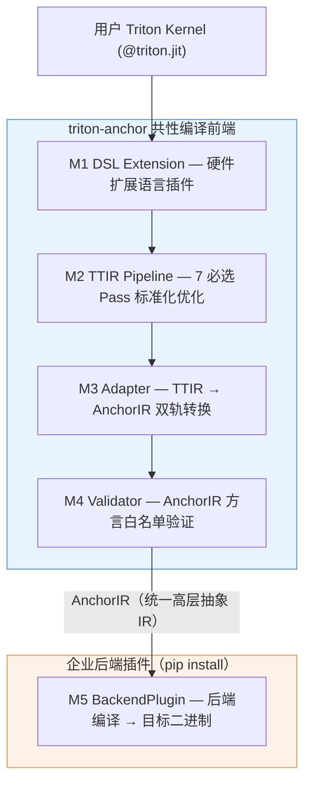

# RISC-V AI 扩展指令集系统软件栈研发项目 — 第三方测试大纲

**V1.0**

| | |
|---|---|
| **项目名称** | 面向多款 RISC-V AI 处理器的开源编译前端工具链 |
| **承担单位** | 开芯院 |
| **项目执行期** | 2025.01 ~ 2026.12 |
| **填报日期** | 2026 年 04 月 |

---

## 目录

- [第一章 项目概况](#第一章-项目概况)
- [第二章 测试依据和考核指标](#第二章-测试依据和考核指标)
- [第三章 测试环境](#第三章-测试环境)
- [第四章 测试方案](#第四章-测试方案)
  - [4.3 测试用例与研发目标的对应关系](#43-测试用例与研发目标的对应关系)
- [附件1：测试用例细节](#附件1测试用例细节)
- [附件2：指标定义](#附件2指标定义)

---

## 第一章 项目概况

### 1.1 项目信息

实现并开源发布面向多款 RISC-V 处理器和 AI 扩展指令集的开源编译前端工具链（项目代号：triton-anchor），支持基于 Triton 实现的通用算子代码转换为高层中间表示（IR），提供高层抽象 IR，被企业研发的编译后端工具链所集成，用以支持 3 款以上企业研发的 RISC-V AI 处理器的适配和优化，形成基于 RISC-V 的 Matrix 和 Tensor 至少 2 种类型扩展指令的全栈编译。

合作企业及其同步开发任务：

- **算能（Sophgo）**：研发 RISC-V AI 处理器（Tensor 扩展指令），性能不低于 8TFLOPS@FP16。提供面向共性编译前端的编译后端工具链，支持 FlagGems-127 至少 80% 算子，其中至少 40% 算子提供优化实现，平均性能提升 ≥ 1.2 倍。
- **进迭时空（SpacemiT）**：RISC-V AME Matrix 扩展指令集处理器。
- **风华创智（USC）**：RISC-V gpGPU SIMT 架构处理器。
- **清微智能（Tsingmicro）**：RISC-V AME Matrix 扩展指令集处理器（可选第 4 款）。

本文档围绕上述总体任务，定义 triton-anchor 编译前端工具链的第三方测试用例，将总体任务分解为三项核心子任务进行验收：

- **任务一：统一编译前端架构** — 验证插件化体系、AnchorIR 双轨规范、≥ 2 种计算范式支持
- **任务二：全链路编译集成** — 验证 ≥ 3 款企业后端的端到端编译与执行正确性
- **任务三：一致性验证** — 验证共性前端编译路径与企业原生工具链的性能一致性（≥ 95%）和数值一致性

此外，设置**前置验收**环节，验证开源发布可获取性和企业集成基础条件，作为三项子任务的执行前提。

### 1.2 软件架构

triton-anchor 采用全插件化五层架构，由五个分系统模块组成：

- **M1**：DSL 扩展系统，厂商以独立 pip 包发布语言扩展
- **M2**：TTIR 优化引擎，所有后端共享的编译基础设施
- **M3**：Adapter 适配系统，提供 TritonShared/TritonLinalg/TritonGPU 三种适配器
- **M4**：AnchorIR 契约验证，双轨白名单（Linalg Track / TritonGPU Track）
- **M5**：后端编译接口，厂商通过 `pip install` 即可接入

---

## 第二章 测试依据和考核指标

### 2.1 考核指标

| 编号 | 考核指标 | 量化标准 | 考核归属 |
|---|---|---|---|
| KPI-0.1 | 开源发布 | 源码在指定平台公开，第三方可 pip 安装 | 本项目 |
| KPI-0.2 | 企业集成 | ≥ 3 款后端纯 pip 插件接入，前端零修改 | 本项目 |
| KPI-1.1 | 计算范式覆盖 | ≥ 2 种（Matrix AME + Tensor） | 本项目 |
| KPI-1.2 | AnchorIR 合规率 | 100% 通过 validate_anchor_ir() | 本项目 |
| KPI-1.3 | 插件化体系 | entry_points 自动发现，安装/卸载互不影响 | 本项目 |
| KPI-1.4 | 编译时延 | Linalg Track ≤ 3s，TritonGPU Track ≤ 2s | 本项目 |
| KPI-2.1 | 后端集成数量 | ≥ 3 款，覆盖 ≥ 2 种范式 | 本项目 |
| KPI-2.2 | P0 算子打通率 | tt.dot/tt.load/tt.store/tt.reduce/arith/math 100% | 本项目 |
| KPI-2.3 | FlagGems 覆盖率 | ≥ 80%（算能后端） | 合作企业 |
| KPI-2.4 | 优化算子提升 | ≥ 1.2 倍（≥ 40% 算子） | 合作企业 |
| KPI-3.1 | 性能一致性 | triton-anchor vs 原生路径 ≥ 95% | 本项目 |
| KPI-3.2 | 数值一致性 | FP32 rtol≤1e-5，FP16 rtol≤1e-3 | 本项目 |

> **说明**：KPI-2.3（FlagGems 覆盖率）和 KPI-2.4（优化算子提升）属于合作企业同步开发任务的考核指标，由企业自行验收。本测试文档聚焦于 triton-anchor 共性前端自身的考核指标，重点验证**一致性**：即采用共性前端编译出的算子运行性能与企业自身工具链编译出的算子运行性能一致。

### 2.2 测试依据

- 《triton-anchor 编译前端工具链系统设计文档 v1.0》
- 企业同步开发任务书（2.1.1 / 2.1.2 / 2.1.3 节）
- 开芯院 AME 指令集标准文档
- 智源 FlagGems-127 通用 AI 算子库规范
- 智源算子评测平台评测标准

---

## 第三章 测试环境

### 3.1 测试地点

开芯院联调联试实验室（各企业交付不少于 1 套硬件平台至开芯院）。

### 3.2 测试环境

**硬件设备**

| 企业 | 硬件形态 | 型号 | 关键技术参数 |
|---|---|---|---|
| 进迭时空 | FPGA 原型/流片 | SpacemiT X60 | AME Matrix 扩展指令集 |
| 算能 | 流片/FPGA/仿真加速器 | BM1684X 系列 | Tensor 扩展指令，≥ 8TFLOPS@FP16 |
| 风华创智 | FPGA/仿真加速器 | USC GPU | SIMT 架构 |

**软件及版本号**

| 软件 | 版本 | 用途 |
|---|---|---|
| Ubuntu Linux | 20.04+ | 操作系统 |
| Python | ≥ 3.8 | 运行环境 |
| triton-anchor | v1.0 | 被测软件 |
| 各企业后端插件 | 随企业交付 | pip install 安装 |
| FlagGems-127 | 智源发布版 | 通用算子库 |
| PyTorch | ≥ 2.0 | 参考实现/数值对比 |
| pytest | latest | 自动化测试框架 |

**测试环境搭建说明**

1. 在干净 Linux 环境安装 Python ≥ 3.8
2. 执行 `pip install triton-anchor` 安装编译前端
3. 执行 `pip install triton-backend-{vendor}` 安装各企业后端插件
4. 连接企业交付的硬件平台，验证 `validate_environment()` 返回成功
5. 安装 FlagGems-127 算子库和 PyTorch

---

## 第四章 测试方案

### 4.1 测试说明

本测试方案共设计 **36 个测试用例**，按测试级别划分为：

- **单元测试（UT）**：20 个 — 针对前端各模块（M1–M4）的独立行为验证，无硬件依赖，验证编译/安装/契约/IR 层面的正确性。
- **系统测试（ST）**：16 个 — 涉及全链路编译 + 硬件执行，需要真实企业后端插件和硬件平台，验证系统级交付能力。

测试编号中 **XN** 代表"性能测试"，**GN** 代表"功能测试"。附件 1 给出了全部测试用例的详细说明。

> **测试边界说明**：算子覆盖度（FlagGems 通过率 ≥ 80%）和算子绝对性能（优化算子提升 ≥ 1.2 倍）属于合作企业同步开发任务的考核指标（KPI-2.3 / KPI-2.4），不纳入本测试范围。本测试聚焦于**一致性验证**：即采用共性前端（triton-anchor）编译出的算子运行性能和数值结果，与企业自身工具链编译出的结果保持一致。

### 4.2 测试用例

**表 2 测试指标和用例一览表**

| 项目考核指标 | 指标分解 | 测试项 | 编号 | 测试级别 | 所属任务 |
|---|---|---|---|---|---|
| **KPI-0 交付前提** | 开源发布 | 开源发布可获取性验证 | G01 | UT | 前置验收 |
| | | 第三方独立安装与运行验证 | G02 | UT | 前置验收 |
| | 企业集成 | 企业后端零修改集成验证 | G03 | ST | 前置验收 |
| | | 企业复用前端全链路确认 | G04 | ST | 前置验收 |
| **KPI-1 统一前端架构** | 计算范式覆盖 | Matrix AME 范式编译路径 | G05 | UT | 任务一 |
| | | Tensor 范式编译路径 | G06 | UT | 任务一 |
| | | gpGPU 范式编译路径 | G07 | UT | 任务一 |
| | | 双轨覆盖完整性 | G08 | UT | 任务一 |
| | AnchorIR 合规 | Linalg Track 白名单合规 | G09 | UT | 任务一 |
| | | 禁止方言拦截 | G10 | UT | 任务一 |
| | | 扩展方言白名单机制 | G11 | UT | 任务一 |
| | 插件化体系 | 后端插件自动发现 | G12 | UT | 任务一 |
| | | DSL Extension 插件发现 | G13 | UT | 任务一 |
| | | 插件隔离性 | G14 | UT | 任务一 |
| | | 核心不变量稳定性 | G15 | UT | 任务一 |
| | 编译时延 | 前端编译时延基准 | X01 | UT | 任务一 |
| **KPI-2 全链路集成** | 后端集成 | 后端集成数量验证 | G16 | ST | 任务二 |
| | | HWCapability 声明验证 | G17 | UT | 任务二 |
| | 核心算子全链路 | GEMM 全链路（参数化） | G18 | ST | 任务二 |
| | | Softmax 全链路 | G19 | ST | 任务二 |
| | | LayerNorm 全链路 | G20 | ST | 任务二 |
| | | Elementwise 全链路 | G21 | ST | 任务二 |
| | | Memory 操作全链路 | G22 | ST | 任务二 |
| | 覆盖度矩阵 | OpCoverageMatrix 生成 | G23 | UT | 任务二 |
| | | P0 算子 100% 覆盖 | G24 | UT | 任务二 |
| | | Unsupported 算子拦截 | G25 | UT | 任务二 |
| | 企业联合验证 | 进迭时空后端集成（Matrix AME） | G26 | ST | 任务二 |
| | | 算能后端集成（Tensor） | G33 | ST | 任务二 |
| | | 风华创智后端集成（gpGPU） | G34 | ST | 任务二 |
| **KPI-3 性能一致性** | 性能无损 | GEMM 性能 A/B 对比 | X03 | ST | 任务三 |
| | | Softmax 性能 A/B 对比 | X04 | ST | 任务三 |
| | | LayerNorm 性能 A/B 对比 | X05 | ST | 任务三 |
| | | Elementwise 性能 A/B 对比 | X06 | ST | 任务三 |
| | | IR 级无损验证 | G28 | UT | 任务三 |
| | 数值一致性 | 整数 Bitwise 一致性 | G31 | UT | 任务三 |
| | | 浮点容差一致性 | G32 | ST | 任务三 |

### 4.3 测试用例与研发目标的对应关系

项目研发总目标为：

> "实现并开源发布面向多款 RISC-V 处理器和 AI 扩展指令集的开源编译前端工具链（项目代号：triton-anchor），支持基于 Triton 实现的通用算子代码转换为高层中间表示（IR），提供高层抽象 IR，被企业研发的编译后端工具链所集成，用以支持 3 款以上企业研发的 RISC-V AI 处理器的适配和优化，形成基于 RISC-V 的 Matrix 和 Tensor 至少 2 种类型扩展指令的全栈编译。"

本文档将上述目标分解为**前置验收 + 三项核心子任务**，36 个测试用例全部通过后，即体现研发总目标的完整实现。下表说明各子任务由哪些测试用例覆盖，以及全部通过后如何体现对应子任务的达成。

**表 3 测试用例 → 研发目标追溯矩阵**

#### 前置验收：开源发布与企业集成基础（4 项：G01–G04）

| 覆盖用例 | 测试级别 | 对应研发目标关键词 |
|----------|:--------:|------------------|
| G01、G02 | UT | "实现并**开源发布**" |
| G03、G04 | ST | "被**企业研发的编译后端工具链所集成**" |

**通过后的达成体现**：G01 通过证明源码在指定平台 public 可访问、LICENSE 明确；G02 通过证明第三方可在干净环境下 `pip install` 独立安装并编译 kernel，工具链具备完整的开源交付能力。G03 通过证明 3 款企业后端以纯 `pip install` 插件方式接入、前端源码零修改（commit hash 不变）；G04 通过证明企业后端实际复用前端 M2→M3→M4 编译管线（日志可追踪）。**前置验收全部通过，确认工具链已开源发布且企业后端可无侵入集成，为后续三项子任务提供执行基础。**

#### 任务一：统一编译前端架构（12 项：G05–G15、X01）

| 覆盖用例 | 测试级别 | 对应研发目标关键词 |
|----------|:--------:|------------------|
| G05–G08 | UT | "面向多款 RISC-V 处理器和 AI 扩展指令集"、"**Matrix 和 Tensor 至少 2 种类型**扩展指令" |
| G09–G11 | UT | "转换为**高层中间表示（IR）**，提供**高层抽象 IR**" |
| G12–G15 | UT | "被企业研发的编译后端工具链所集成"（插件化基础设施） |
| X01 | UT | 编译时延可用性保证 |

**通过后的达成体现**：G05–G08 通过证明 TTIR 可分别通过 Linalg Track 和 TritonGPU Track 产出 AnchorIR，覆盖 Matrix AME / Tensor / gpGPU 三种计算范式，满足"≥ 2 种类型扩展指令"要求；G09–G11 通过证明 AnchorIR 满足方言白名单契约（100% 合规率），禁止 `tt.*` 残留，扩展方言可注册，体现"高层抽象 IR"的规范性；G12–G15 通过证明 entry_points 自动发现、插件隔离、核心 7 Pass 不变量稳定，体现全插件化架构的工程可靠性；X01 通过证明前端编译时延在可接受范围内（Linalg Track ≤ 3s）。**任务一全部通过，证明 triton-anchor 的统一编译前端架构设计正确：插件化体系完备、AnchorIR 双轨规范稳定、≥ 2 种计算范式全覆盖。**

#### 任务二：全链路编译集成（13 项：G16–G26、G33、G34）

| 覆盖用例 | 测试级别 | 对应研发目标关键词 |
|----------|:--------:|------------------|
| G16、G17 | ST/UT | "支持 **3 款以上**企业研发的 RISC-V AI 处理器" |
| G18–G22 | ST | "通用**算子**代码转换"（3 后端 × 多算子 全链路） |
| G23–G25 | UT | "通用算子"覆盖度量化与边界保护 |
| G26 | ST | 进迭时空后端集成— **Matrix AME** 扩展指令集 |
| G33 | ST | 算能后端集成— **Tensor** 扩展指令集 |
| G34 | ST | 风华创智后端集成— **gpGPU** SIMT 架构 |

**通过后的达成体现**：G16 通过证明已集成 ≥ 3 款后端且覆盖 ≥ 2 种计算范式；G17 通过证明后端正确声明 HWCapability 接口；G18–G22 通过证明五类核心算子在 3 款后端上全链路编译执行且数值正确；G26/G33/G34 分别通过证明进迭时空（Matrix AME）、算能（Tensor）、风华创智（gpGPU）三家企业后端的端到端集成成功，覆盖 Matrix AME 和 Tensor 至少 2 种扩展指令集类型。**任务二全部通过，证明 3 家企业的 RISC-V AI 处理器的端到端编译集成已打通，覆盖 ≥ 2 种扩展指令集，核心算子全链路执行正确。**

#### 任务三：一致性验证（7 项：G28、G31–G32、X03–X06）

> 本任务聚焦于**共性前端编译路径与企业原生工具链的一致性**，包括性能一致性（运行性能无损）和数值一致性（计算结果等价）。算子覆盖度和绝对性能属于合作企业考核范畴，不在本任务范围内。

| 覆盖用例 | 测试级别 | 对应研发目标关键词 |
|----------|:--------:|------------------|
| X03–X06 | ST | "形成…**全栈编译**"（性能一致性：triton-anchor 路径 vs 企业原生路径） |
| G28 | UT | IR 级语义无损（编译产出等价性） |
| G31、G32 | UT/ST | 跨后端数值一致性（整数 Bitwise + 浮点容差） |

**通过后的达成体现**：X03–X06 通过证明 triton-anchor 路径 vs 企业原生路径性能比 ≥ 95%（覆盖 GEMM / Softmax / LayerNorm / Elementwise 四类核心算子 × 多 dtype × 多 shape），即共性前端编译出的算子运行性能与企业自身工具链编译出的算子运行性能一致；G28 通过证明 IR 级别语义无损；G31 通过证明整数运算 Bitwise 精确一致；G32 通过证明各后端浮点运算满足容差标准（FP32 rtol≤1e-5, FP16 rtol≤1e-3）。**任务三全部通过，证明共性前端路径性能无损、数值一致，全栈编译的一致性满足工程要求。**

#### 总结

| 验收环节 | 用例数 | UT | ST | 通过后证明 |
|:--------:|:-----:|:--:|:--:|-----------|
| 前置验收 | 4 | 2 | 2 | 工具链已开源发布，企业后端可无侵入集成 |
| 任务一 | 12 | 12 | 0 | 插件化体系完备，AnchorIR 双轨规范稳定，≥ 2 种范式覆盖 |
| 任务二 | 13 | 4 | 9 | 3 家企业处理器集成打通，覆盖 ≥ 2 种扩展指令集 |
| 任务三 | 7 | 2 | 5 | 共性前端路径性能无损（≥ 95%），数值一致性满足要求 |
| **合计** | **36** | **20** | **16** | **研发总目标完整实现** |

---

## 附件1：测试用例细节

### 1. 前置验收

#### 1.1 开源发布可获取性验证

| 项目 | 内容 |
|---|---|
| **用例编号** | G01 |
| **测试软件** | triton-anchor v1.0 |
| **测试类型** | 功能测试 |
| **测试级别** | ST |
| **测试内容** | 验证源码在指定开源平台公开发布，含完整源码、README、LICENSE、pyproject.toml |
| **通过标准** | 仓库 public 可访问，许可证明确，支持标准 pip 打包 |
| **测试方法** | 访问开源托管平台（GitHub/Gitee），人工检查仓库状态和文件完整性 |
| **测试数据** | 无 |

#### 1.2 第三方独立安装与运行验证

| 项目 | 内容 |
|---|---|
| **用例编号** | G02 |
| **测试软件** | triton-anchor v1.0 |
| **测试类型** | 功能测试 |
| **测试级别** | ST |
| **测试内容** | 在干净 Linux 环境中 git clone → pip install -e . → 安装后端插件 → 编译最小 GEMM kernel 算子 |
| **通过标准** | 全部步骤无报错，AnchorIR 正确产出 |
| **测试方法** | 在无预装环境的 Linux 机器上依序执行安装和编译命令 |
| **测试数据** | 标准 GEMM kernel 源码 |

#### 1.3 企业后端零修改集成验证

| 项目 | 内容 |
|---|---|
| **用例编号** | G03 |
| **测试软件** | triton-anchor v1.0 + 3 款企业后端插件 |
| **测试类型** | 功能测试 |
| **测试级别** | ST |
| **测试内容** | 记录前端 commit hash H0 → pip install 3 款后端 → 验证 hash 不变 → 各后端编译执行 GEMM |
| **通过标准** | 前端源码零修改（commit hash 不变），3 款后端均成功编译执行 |
| **测试方法** | git rev-parse HEAD 对比 + pytest 自动化 |
| **测试数据** | GEMM kernel，FP32，512×512 |

### 2. 统一编译前端架构

#### 2.1 全链路测试（参数化）

| 项目 | 内容 |
|---|---|
| **用例编号** | G18 |
| **测试软件** | triton-anchor + 各企业后端 |
| **测试类型** | 功能测试 |
| **测试级别** | 系统测试（ST） |
| **测试内容** | 3 后端 × 2 数据类型(FP32/FP16) × 3 形状(64²/512²/1024²) 全链路编译执行 |
| **通过标准** | 数值误差在容差内（FP32 rtol=1e-5, FP16 rtol=1e-3） |
| **测试方法** | pytest 参数化，NumPy 参考对比 |
| **测试数据** | 随机生成矩阵，固定种子 seed=42 |

#### 2.2 前端编译时延基准测试

| 项目 | 内容 |
|---|---|
| **用例编号** | X01 |
| **测试软件** | triton-anchor v1.0 |
| **测试类型** | 性能测试 |
| **测试级别** | 单元测试（UT） |
| **测试内容** | GEMM(512×512×256) kernel，分别计时 M2/M3/M4 三阶段，重复 5 次取平均 |
| **通过标准** | 总体≤3s |
| **测试方法** | Python time.perf_counter() 计时 |
| **测试数据** | 标准 GEMM kernel |

### 3. 企业联合验证（3 家企业 × 2 种扩展指令集）

#### 3.1 进迭时空/清微智能后端集成验证（Matrix AME）

| 项目 | 内容 |
|---|---|
| **用例编号** | G26 |
| **测试软件** | triton-anchor v1.0 + triton-backend-spacemit |
| **测试类型** | 功能测试 |
| **测试级别** | 系统测试（ST） |
| **测试内容** | pip install 进迭后端插件 → 编译 GEMM/Softmax kernel → 在 SpacemiT X60（AME Matrix 扩展指令集）上执行 → 验证数值正确性 |
| **通过标准** | 后端自动发现成功，kernel 编译执行无报错，数值误差在容差内 |
| **测试方法** | pytest 自动化，NumPy 参考对比 |
| **测试数据** | GEMM FP32 512×512，Softmax FP32 1024 |
| **验证指令集** | **Matrix AME** 扩展指令集（Linalg Track） |

#### 3.2 算能后端集成验证（Tensor）

| 项目 | 内容 |
|---|---|
| **用例编号** | G33 |
| **测试软件** | triton-anchor v1.0 + triton-backend-sophgo |
| **测试类型** | 功能测试 |
| **测试级别** | 系统测试（ST） |
| **测试内容** | pip install 算能后端插件 → 编译 GEMM/Softmax kernel → 在 BM1684X（Tensor 扩展指令集）上执行 → 验证数值正确性 |
| **通过标准** | 后端自动发现成功，kernel 编译执行无报错，数值误差在容差内 |
| **测试方法** | pytest 自动化，NumPy 参考对比 |
| **测试数据** | GEMM FP16 512×512，Softmax FP16 1024 |
| **验证指令集** | **Tensor** 扩展指令集（Linalg Track） |

#### 3.3 风华创智后端集成验证（gpGPU）

| 项目 | 内容 |
|---|---|
| **用例编号** | G34 |
| **测试软件** | triton-anchor v1.0 + triton-backend-usc |
| **测试类型** | 功能测试 |
| **测试级别** | 系统测试（ST） |
| **测试内容** | pip install 风华后端插件 → 编译 GEMM/Softmax kernel → 在 USC GPU（gpGPU SIMT 架构）上执行 → 验证数值正确性 |
| **通过标准** | 后端自动发现成功，kernel 编译执行无报错，数值误差在容差内 |
| **测试方法** | pytest 自动化，NumPy 参考对比 |
| **测试数据** | GEMM FP32 512×512，Softmax FP32 1024 |
| **验证指令集** | **gpGPU** SIMT 架构（TritonGPU Track） |

> **说明**：G26/G33/G34 三个用例共同验证"支持 3 款以上企业研发的 RISC-V AI 处理器"和"Matrix 和 Tensor 至少 2 种类型扩展指令的全栈编译"两项核心交付要求。算子覆盖度（KPI-2.3）和优化算子提升（KPI-2.4）属于合作企业考核指标，不在本测试范围内。

### 4. 性能无损与数值一致性

#### 4.1 核心算子性能 A/B 对比

| 项目 | 内容 |
|---|---|
| **用例编号** | X03 |
| **测试软件** | triton-anchor + 企业原生工具链 |
| **测试类型** | 性能测试 |
| **测试级别** | 系统测试（ST） |
| **测试内容** | A路径(企业原生)编译 GEMM 执行 100 次取 T_A；B路径(triton-anchor)同条件取 T_B；R=T_A/T_B |
| **通过标准** | R ≥ 0.95（所有 后端×dtype×shape 组合） |
| **测试方法** | 预热 10 次 + 执行 100 次取中位数 |
| **测试数据** | FP32/FP16 × 512²/1024²/2048² |

#### 4.2 浮点容差一致性

| 项目 | 内容 |
|---|---|
| **用例编号** | G32 |
| **测试软件** | triton-anchor + 各后端 |
| **测试类型** | 功能测试 |
| **测试级别** | 系统测试（ST） |
| **测试内容** | CPU/NumPy 为基准，各后端执行 GEMM/Softmax/LayerNorm，计算 rtol/atol |
| **通过标准** | FP32 rtol≤1e-5 atol≤1e-6；FP16 rtol≤1e-3 atol≤1e-4 |
| **测试方法** | torch.testing.assert_close() |
| **测试数据** | 固定种子 seed=42 随机张量 |

---

## 附件2：指标定义

| 指标编号 | 指标名称 | 定义 | 计算公式/标准 | 考核归属 |
|---|---|---|---|---|
| KPI-0.1 | 开源发布 | 源码在指定开源平台公开发布，第三方可自由获取安装 | 仓库 public + LICENSE + pip install 成功 | 本项目 |
| KPI-0.2 | 企业集成 | 企业后端以纯插件方式接入，不修改前端源码 | commit_hash_after == commit_hash_before，且 ≥ 3 后端接入 | 本项目 |
| KPI-1.1 | 计算范式覆盖 | 支持的 AI 扩展指令集计算范式种类数 | count(supported_paradigms) ≥ 2 | 本项目 |
| KPI-2.1 | 后端集成数量 | 已完成插件化集成的企业后端数量 | count(backends) ≥ 3，count(paradigms) ≥ 2 | 本项目 |
| KPI-3.1 | 性能一致性 | triton-anchor 路径 vs 企业原生路径的性能比 | R = T_native / T_anchor ≥ 0.95 | 本项目 |
| KPI-3.2 | 数值一致性 | 同一 kernel 跨后端执行结果的数值误差 | FP32: rtol ≤ 1e-5, atol ≤ 1e-6；FP16: rtol ≤ 1e-3, atol ≤ 1e-4 | 本项目 |

